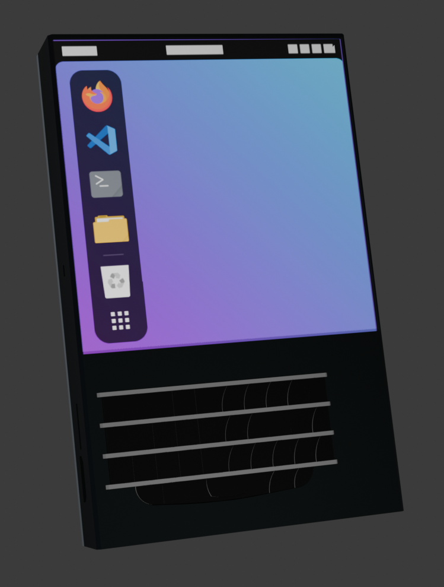
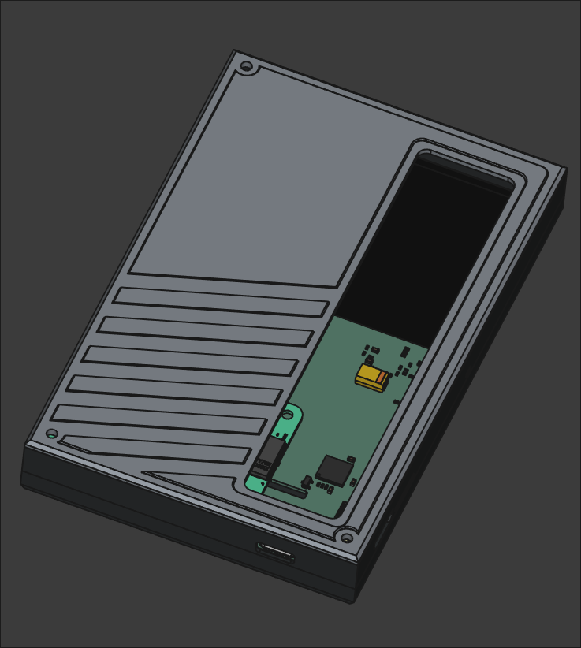
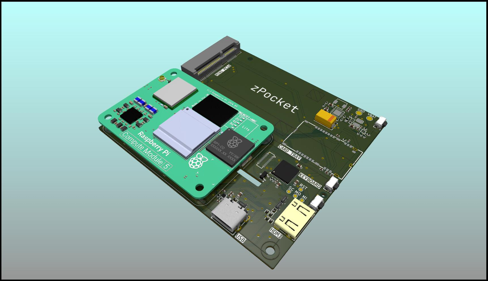

# zPocket
> WIP

The zPocket is a modular, handheld portable Linux device with a square touchscreen as well as keyboard for input. The modularity allows you to use it as a Cyberdeck, Phone, or even satellite communicator.

## Significant features:
- Touchscreen 720x720 panel
- Blackberry Q10 Keyboard
- Raspberry Pi Compute Module 5
- Mini PCIe connector
- USB-C Dual-role Port and mini HDMI
- Magnetometer (Compass)
- Battery Charging and Gauge

## Assembly Render
Front                                                   |  Back
:------------------------------------------------------:|:--------------------------------------:
  |  

## PCB

